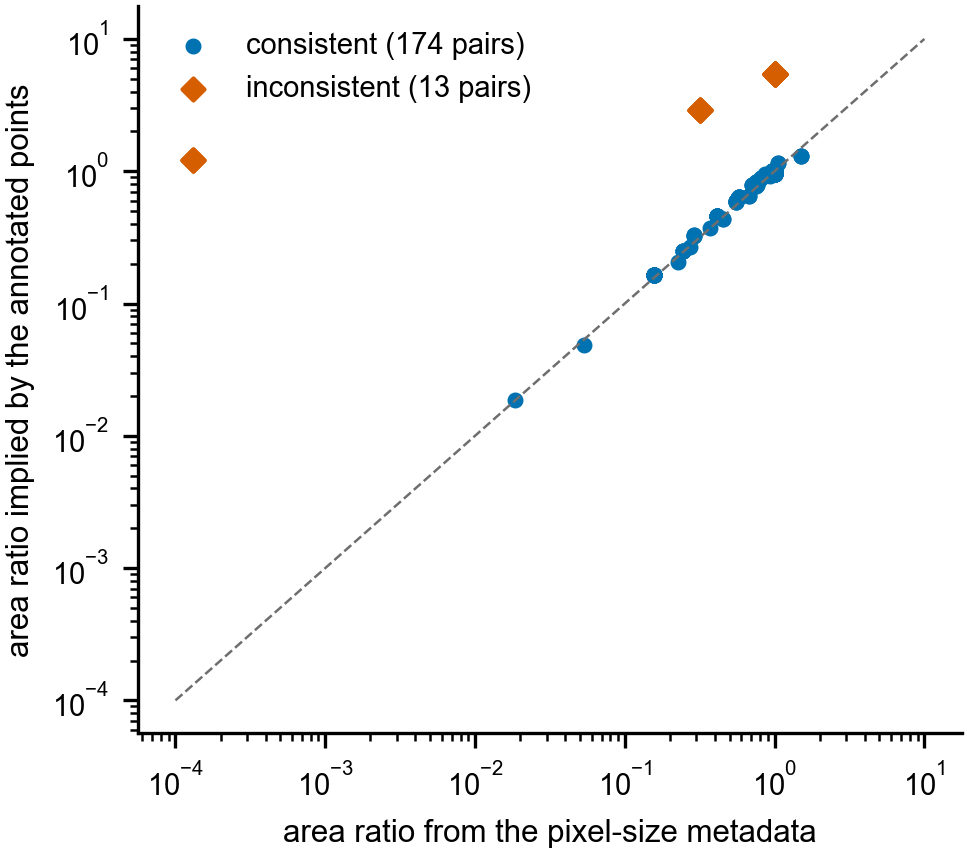
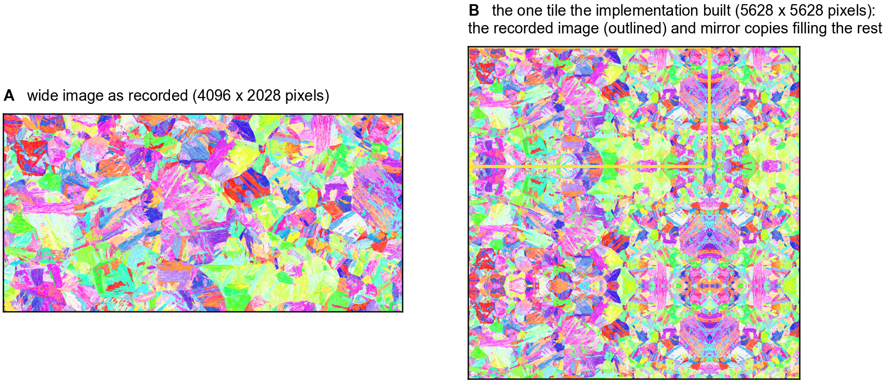
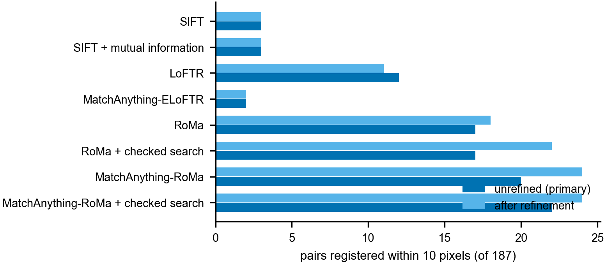

# Supplementary Material

**Image tiling does not solve field-of-view mismatch in correlative microscopy registration**

Frank Cai, Purdue University

Every number in this document is recomputed from the released per-pair result files by `scripts/mam_rewrite_numbers.py` (repository: https://github.com/fronkt/correlative-microscopy-alignment), unless a section says otherwise.

---

## S1. The pooled-tiling run in detail

**What was evaluated.** The run of pooled tiling with RoMa processed the 187 pairs in the fixed order of our data loader, which sorts by series name. The first 81 pairs completed. At the 82nd pair the graphics processor raised the error `CUDA error: unknown error`, and every one of the remaining 106 pairs failed with the same message, because the failed processor context was reused for each later pair. None of the 106 failures is a failure of the method: the method never ran on those pairs. The run was not repeated. `scripts/pyramid_v1_audit.py` checks this from the result file: every failed row carries the error string, the failures form one unbroken block at the end of the run, and for every completed pair the number of pooled correspondences equals 10,000 times the number of tiles recomputed from the image sizes.

Table S1 lists the series and how many of each series' pairs were evaluated. The 106 unevaluated pairs include every TEM and STEM pair in the benchmark, and 6 pairs that RoMa registers within 10 pixels when used directly (two from the TRIP1 steel series, all three from the MAX-phase series, and one from the X2CrNi12 steel series). Completing the run would take 4,303 further tile matches.

**Padding.** The tile side is the shorter side of the narrow image, measured in the narrow image's pixels. When the wide image is smaller than that in either dimension, `cma.pyramid.build` fills a single square tile with the wide image and mirror images of it. This happens on 57 of the 187 pairs, 48 of them among the 81 evaluated. Supplementary Figure S2 shows an extreme case: a 4,096 by 2,028 pixel EBSD map placed in a 5,628 by 5,628 pixel tile, so that the recorded image fills 26 % of the tile and mirror copies fill the rest. These pairs test padding rather than tiling, and the main text reports them separately (Table 4).

**Pairs that pooling improved.** On 7 of the 33 genuinely tiled pairs pooling lowered the error. In every case the direct match had missed by more than 100 pixels, and in none did pooling come within 20 pixels; the largest improvement was from 1,464 to 20.4 pixels, on a pair of an SEM backscattered-electron image and a light optical image.

**Table S1.** Pooled-tiling coverage by series (loader order). "Tiles" is the total number of tile matches the series needs.

| Series | Evaluated | Not evaluated | Tiles |
|----------------------------------------|----------|------------|--------|
| 5842WCu, SEM secondary / backscattered electrons | 1 | 0 | 1 |
| AF9628 steel, SEM mosaic / EBSD | 15 | 0 | 132 |
| C103, SEM / light optical height | 6 | 0 | 56 |
| CoNi-AM67, light optical / SEM | 3 | 0 | 18 |
| CoNi-AM67, SEM / EBSD, serial sections | 18 | 0 | 1,554 |
| CoNi-AM90, light optical / SEM | 2 | 0 | 954 |
| CoNi-AM90, SEM strain map / EBSD | 27 | 0 | 27 |
| CoNi-AM90, SEM / EBSD | 6 | 0 | 6 |
| CoNi, SEM secondary / backscattered electrons, cracks | 1 | 0 | 15 |
| In718 precipitation-strengthened, SEM / EBSD | 2 | 2 | 2,508 |
| In718 precipitation-strengthened, SEM strain map / EBSD | 0 | 4 | 4 |
| In718 solution-strengthened, SEM / EBSD | 0 | 10 | 173 |
| MoTaTiZrHf, 1100 °C, STEM | 0 | 32 | 64 |
| MoTaTiZrHf, 900 °C, STEM | 0 | 16 | 32 |
| MoTaTiZrHf, 900 °C, STEM, large field | 0 | 18 | 36 |
| TRIP1 steel, light optical / SEM / EBSD | 0 | 7 | 30 |
| Ta, SEM / EBSD | 0 | 9 | 2,397 |
| Ti3AlC2 MAX phase, TEM | 0 | 3 | 10 |
| X2CrNi12 steel, SEM mosaic / EBSD | 0 | 5 | 303 |
| **Total** | **81** | **106** | **8,320** |

## S2. Field of view from the metadata and from the annotated points

The benchmark records a physical pixel size for every image. Multiplying by the image dimensions gives each image's field of view, and the ratio of the two gives a field-of-view ratio for the pair. The annotated points give a second, independent estimate: an affine mapping fitted to a pair's points converts areas in one image into areas in the other (main text, Section 2.2). For 174 of the 187 pairs the two estimates agree within 25 %. For the 13 pairs in Table S2 they do not, and the disagreement cannot be a small annotation error (Supplementary Figure S1).

The clearest case is scene 3 of the AF9628 series. Its SEM mosaic is 10,147 pixels wide, and the metadata gives a pixel size of 9,258 nm, which would make the mosaic 93.9 mm wide. The annotated points imply a pixel size of 97.3 nm, about a hundredth of the recorded value, which suggests a decimal error in the metadata. For the two In718 series the metadata ratio is off by factors of 5.4 and 9.1; where the true value lies we cannot tell from the images alone, but the annotated points are what every error in the benchmark is measured against, so we use them.

The consequences for the paper are these. (i) The field-of-view groups of Table 5 use the ratio from the annotated points; with the metadata ratio the groups hold 4, 33, 24 and 126 pairs instead of 2, 34, 28 and 123, and 14 pairs change group. (ii) The correlation between field of view and NMI is +0.21 (*p* = 0.005) with the annotated ratio and +0.22 (*p* = 0.003) with the metadata ratio. (iii) Our loader uses the metadata to decide which image is the wide one, and both tiling schemes use it to choose the tile scale, so on these 13 pairs they may have tiled the narrower image, at the wrong scale. (iv) The ladder crops were sized from the metadata ratio, so for the 8 ladder pairs among the 13 the rung labels are wrong; the main result holds without them (main text, Section 3.4). (v) The direct matchers do not use the metadata, and no error value depends on it.

**Table S2.** Pairs whose metadata disagrees with the annotated points. Ratios are target area over source area in the loader's orientation, medians over the series' affected pairs.

| Series | Pairs | Ratio from metadata | Ratio from annotated points | Factor |
|------------------------------------|-------|-------------|---------------|----------|
| AF9628 steel, SEM mosaic / EBSD, scene 3 | 3 | 0.00013 | 1.22 | about 9,400 |
| In718 precipitation-strengthened, SEM strain map / EBSD | 4 | 0.318 | 2.90 | 9.1 |
| In718 solution-strengthened, SEM / EBSD | 6 | 1.00 | 5.42 | 5.4 |

## S3. Results after thin-plate-spline refinement

The benchmark's protocol refines each fitted transformation with a thin-plate spline through its inliers when there are at least 10 of them. Because that condition depends on the method, refinement runs on a different share of pairs for each method (Table S4), and a refined table mixes refined errors for some methods with unrefined errors for others. Table S3 shows what this does to the paper's three central comparisons. Both comparisons on the real pairs are null before refinement and significant after it; the field-of-view ladder comparison is the reverse. Supplementary Figure S3 shows the counts behind the first two.

Refinement is also not monotone. Across the 16 method configurations in our result files, it turns 13 registrations (error below 10 pixels) into failures. One example: RoMa registers the pair of main-text Figure 2 to 3.3 pixels, and refinement moves it to 37.5 pixels. On the ladder the refined error is not a fair measure at all: the annotated points outside the crop are kept (main text, Section 2.8), and a spline fitted to inliers inside the crop extrapolates poorly outside it. At a ratio of 0.1, refinement reduced the checked search's successes from 9 of 40 to 4.

**Table S3.** The paper's three central comparisons under both errors: the fraction of pairs registered within 10 pixels by the first and second method of each comparison. Paired bootstrap, 10,000 resamples, two-sided.

| Comparison (second against first) | Error | First | Second | Difference | 95 % CI | *p* |
|------------------------|------------|--------|---------|------------|------------------|---------|
| RoMa: checked search against direct | unrefined | 0.091 | 0.091 | +0.000 | −0.016 to +0.016 | 1.00 |
| | refined | 0.096 | 0.118 | +0.021 | +0.005 to +0.043 | 0.034 |
| MatchAnything-RoMa against RoMa | unrefined | 0.091 | 0.107 | +0.016 | −0.011 to +0.043 | 0.33 |
| | refined | 0.096 | 0.128 | +0.032 | +0.005 to +0.064 | 0.035 |
| Ladder at ratio 0.1, MatchAnything-RoMa: checked search against direct | unrefined | 0.075 | 0.225 | +0.150 | +0.050 to +0.275 | 0.0028 |
| | refined | 0.025 | 0.100 | +0.075 | 0.000 to +0.175 | 0.087 |

**Table S4.** How many of the 187 pairs each method's refined error actually comes from refinement. The rest fall back to the unrefined error.

| Method | Pairs refined |
|---------------------------------------------|---------------|
| SIFT | 70 |
| SIFT + mutual information | 0 |
| LoFTR | 93 |
| MatchAnything-ELoFTR | 82 |
| RoMa, with or without the checked search | 187 |
| MatchAnything-RoMa, with or without the checked search | 187 |

## S4. Variants of the checked search

**One zoom or three.** The RoMa run of the checked search on the real pairs zoomed once; a later run with the same code set to repeat the zoom up to three times registered 16 pairs within 10 pixels instead of 17 (difference −0.005, 95 % CI −0.016 to 0.000, *p* = 0.73) and 38 within 20 pixels instead of 41 (−0.016, 95 % CI −0.037 to 0.000, *p* = 0.09). A possible reason is that each extra zoom gives the check another chance to accept a candidate further from the true position.

**Discarding uncertain correspondences.** RoMa's output step sets every certainty above 0.05 to 1 before returning the correspondences (main text, Section 2.4). The variant labelled "certainty 0.5" in our result files discards returned correspondences whose certainty is below 0.5; because of that step, it keeps exactly the correspondences whose original certainty was above 0.05. It was run with up to three zooms, so we compare it with the three-zoom run without the discard. Within 20 pixels it registered 41 pairs against 38 (+0.016, 95 % CI −0.005 to +0.043, *p* = 0.24); within 10 pixels, 15 against 16 (*p* = 0.72); after refinement, the difference within 20 pixels was −0.021 (95 % CI −0.053 to +0.005, *p* = 0.18). The discard kept a median of 8,581 of the 10,000 correspondences, and fewer than 1,000 on only 6 pairs. An earlier report in the repository (reports/metric_sensitivity.md) compared this variant with the one-zoom run and found it significantly worse after refinement; that comparison mixed the discard with the change in zoom count and should not be used.

## S5. Fine-tuning

**Protocol.** MatchAnything-RoMa was fine-tuned on a training set of 131 benchmark pairs from 12 series, with 28 pairs for validation and 28 for testing, split by scene. The feature-extracting part of the network (its VGG and DINOv2 encoders) was held fixed, with its normalisation statistics frozen; the part that turns features into correspondences (about 100 million parameters) was trained. The sparse annotated points of each training pair were turned into a dense target by thin-plate-spline interpolation, and the loss was applied only inside the region the points support. Training used random cropping to vary the field of view and random changes of brightness and contrast, the AdamW optimiser at a learning rate of 2 × 10⁻⁵, and 1,500 steps. The checkpoint kept was the one with the lowest median validation error, at step 900 (17.5 pixels, against 21.7 for the released weights). The anchored variant adds the L2-SP penalty λ/2 ‖θ − θ₀‖² on the trained parameters θ relative to their released values θ₀, with λ in {0, 0.01, 0.1, 1.0}.

**The run whose per-pair results survive.** For one plain fine-tuning run the per-pair results on all pairs were kept, so it can be scored on the unrefined error like everything else in the main text. On the 28 test pairs it registered 7 within 20 pixels against 11 for the released weights, and 3 within 10 pixels against 3. On the 16 TEM and STEM test pairs its median error was 60.9 pixels against 293.8. On the 4 C103 test pairs, a series with no training pairs, the errors before and after fine-tuning were 14.7 and 96.1, 18.5 and 20.3, 6.2 and 387.3, and 11.0 and 984.6 pixels.

**Repeat runs.** Only summary results were kept for the other training runs, and only on the refined error, so these are not directly comparable with the unrefined numbers of the main text. Table S5 lists every run whose summary survives. Both plain fine-tuning and L2-SP register 25.0 % to 28.6 % of the test pairs within 20 pixels after refinement, against 39.3 % for the released weights; neither is better than the other. The checked search did not add to either. Three further runs contributed to an eight-run average in earlier reports in the repository, but their individual results were not kept and cannot be recomputed, so they are not reported here.

**Two weaknesses of the protocol.** First, λ for L2-SP was chosen by looking at the test pairs of the untrained C103 series, because the validation set cannot show the damage (its C103 pairs survive fine-tuning). That choice favours L2-SP, and L2-SP still showed no benefit. Second, only the data-augmentation sampler was seeded, and graphics-processor arithmetic is not exactly repeatable, so repeated runs are independent runs rather than seed replicates.

**Table S5.** Fine-tuning runs whose summary results survive, 28 test pairs, refined error.

| Configuration | Search | Run | Within 10 pixels | Within 20 pixels | Median error (pixels) |
|------------------|---------|--------|------------|------------|--------------|
| Released weights | direct | – | 0.214 | 0.393 | 83.5 |
| Released weights | checked | – | 0.214 | 0.393 | 69.1 |
| Plain, λ = 0 | direct | 4 | 0.250 | 0.286 | 48.3 |
| Plain, λ = 0 | direct | 5 | 0.214 | 0.250 | 47.5 |
| Plain, λ = 0 | direct | 6 | 0.250 | 0.250 | 49.3 |
| Plain, λ = 0 | direct | 7 | 0.214 | 0.286 | 47.2 |
| Plain, λ = 0 | direct | 8 | 0.214 | 0.250 | 47.1 |
| L2-SP, λ = 0.01 | direct | 4 | 0.250 | 0.250 | 70.2 |
| L2-SP, λ = 0.01 | direct | 5 | 0.250 | 0.286 | 50.2 |
| L2-SP, λ = 0.01 | direct | 6 | 0.250 | 0.250 | 43.4 |
| L2-SP, λ = 0.01 | direct | 7 | 0.250 | 0.250 | 50.6 |
| L2-SP, λ = 0.01 | direct | 8 | 0.250 | 0.286 | 47.8 |
| Plain, λ = 0 | checked | 4 to 8 | 0.179 to 0.250 | 0.250 to 0.286 | 45.4 to 53.8 |
| L2-SP, λ = 0.01 | checked | 4 to 8 | 0.214 to 0.286 | 0.250 to 0.286 | 44.0 to 64.4 |

## S6. The project's original hypotheses

The work began with three hypotheses, recorded before the experiments. We give their outcomes for completeness.

**H1: tiling gives a 35 % relative gain in registration at field-of-view ratios below 5 %.** Not supported. Only 2 pairs fall below 5 %; RoMa registers one of them (the pair of main-text Figure 2) with or without the checked search, and no method registers the other. Neither tiling scheme changed that count, and two pairs could not have supported the claim in any case.

**H2: RoMa tolerates partial overlap better than the efficient LoFTR family at small field of view.** Weakly supported. Below a ratio of 0.5, RoMa registers 2 of 64 pairs within 10 pixels and MatchAnything-ELoFTR none; over all pairs, 17 against 2. The direction is consistent, but two pairs are not strong evidence.

**H3: an affine transformation is enough for these pairs.** Supported as stated, with a caveat. Among the 118 results within 20 pixels from the released matchers used directly (including a resizing variant of MatchAnything-ELoFTR not shown in the main text), the fitting step chose an affine transformation for 82 (69 %) and a homography for 36. Affine is enough for about seven pairs in ten. The pairs on which it chose a homography were registered more accurately (median error 6.5 against 11.3 pixels), but that comparison depends on the fitting step's own choice and cannot show that a homography helps.

## S7. The worked-example repeat runs

The figures that show registrations come from repeat runs on a desktop processor with a fixed random seed (main text, Section 2.13), made with `scripts/mam_examples_run.py`. Table S6 compares each with the benchmark run of the same pair. In every case the two agree on whether the pair is registered within 10 pixels. The table also gives, for each repeat run, the share of the 10,000 returned correspondences whose certainty was above RoMa's 0.05 cut-off.

**Table S6.** Repeat runs used in the figures.

| Figure | Pair | Matcher | Repeat run error (pixels) | Benchmark run error (pixels) | Share above cut-off |
|--------|---------------------------|---------------------|---------------|-------------|----------|
| 2 | 5842WCu scene 0, pair 0 | RoMa | 2.7 | 3.3 | 0.98 |
| 3B | CoNi-AM67 SEM / EBSD scene 1, pair 0, tile inside | RoMa | 744 (this tile alone) | – | 0.87 |
| 3C | the same pair, tile outside | RoMa | 1,281 (this tile alone) | – | 0.11 |
| 4A | MoTaTiZrHf 900 °C scene 0, pair 4 | MatchAnything-RoMa | 2,043 | 508 | 0.00 |
| 4B | CoNi-AM67 light optical / SEM scene 0, pair 2 | MatchAnything-RoMa | 623 | 630 | 0.00 |
| 4C | C103 scene 1, pair 0, released weights | MatchAnything-RoMa | 6.3 | 6.2 | 0.46 |
| 4C | the same pair, fine-tuned | MatchAnything-RoMa | 473 | 387 | 0.66 |

## Supplementary Figures

{width=3.6in}

**Figure S1.** Field-of-view ratio from the image metadata against the ratio implied by the annotated points, for all 187 pairs (logarithmic axes). Blue: the 174 pairs whose two estimates agree within 25 %. Vermillion: the 13 pairs of Table S2. The dashed line marks agreement.

{width=6.5in}

**Figure S2.** Mirror padding in the pooled-tiling implementation. **A:** the wide image of an AF9628 steel pair (an EBSD map, 4,096 by 2,028 pixels) as recorded. **B:** the single 5,628 by 5,628 pixel tile the implementation built for this pair: the recorded image (yellow outline) and mirror copies filling the rest. Micrographs: Durmaz et al. (2026a), CC BY 4.0.

{width=4.5in}

**Figure S3.** Number of the 187 pairs registered within 10 pixels, before refinement (dark blue, the main text's error) and after thin-plate-spline refinement (light blue). SIFT with mutual information has no refined results, so its two bars are the same measurement.
