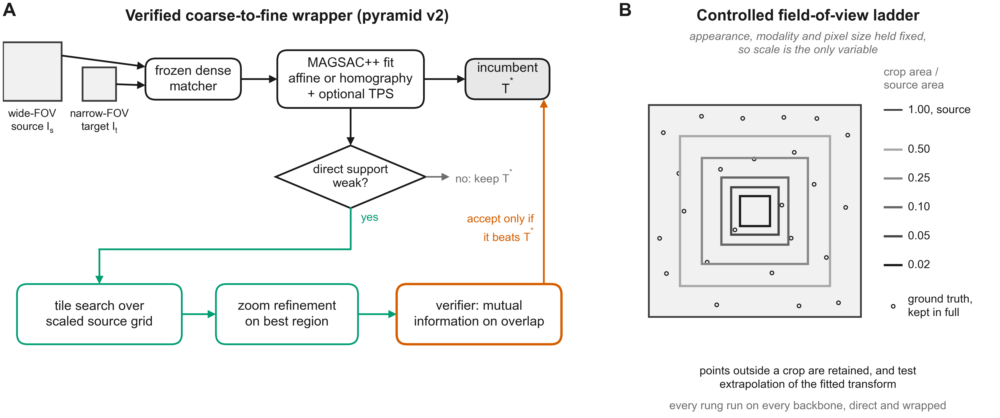
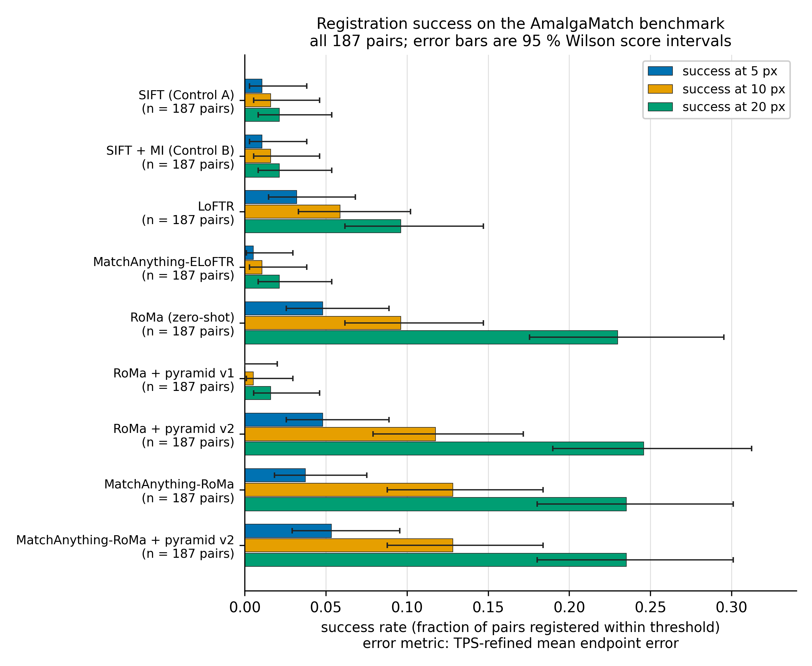
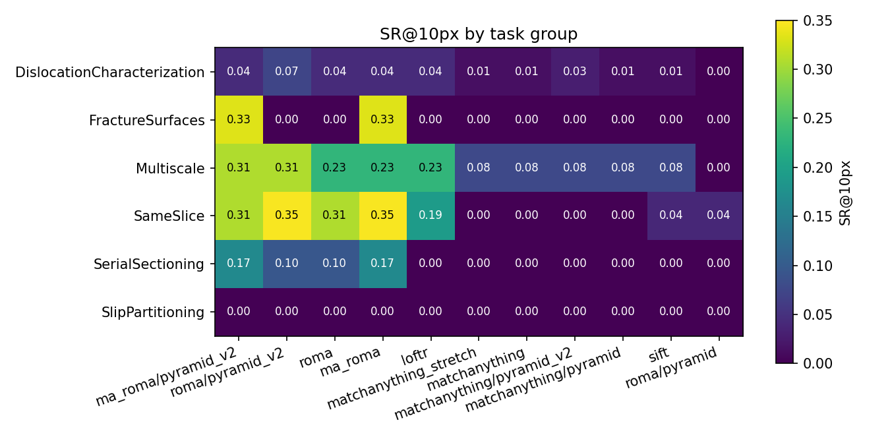
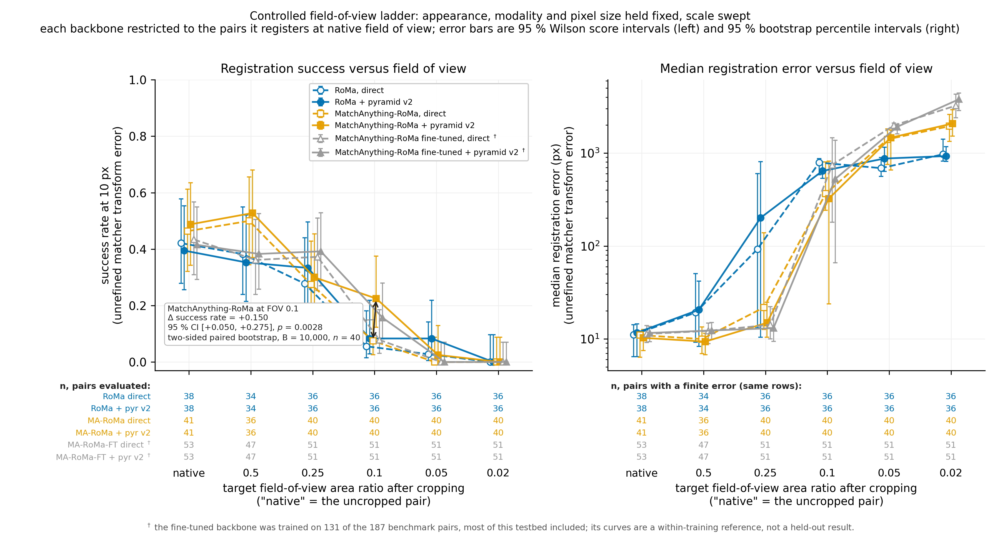
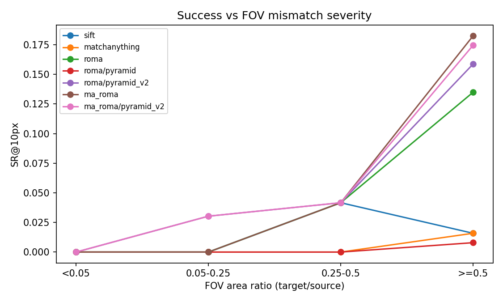

# Pyramidal wrappers break non-abstaining dense matchers: a diagnostic study of foundation-model registration in correlative microscopy

**Frank Cai**
Purdue University, West Lafayette, IN, USA · frankyc11223@gmail.com · ORCID: 0009-0003-0041-1459

*Prepared for submission to Scientific Reports. Keywords: correlative microscopy, image registration, dense feature matching, foundation models, domain fine-tuning, catastrophic forgetting.*

---

## Abstract

Correlative materials microscopy pairs images of one specimen across modalities (SEM, EBSD, TEM, optical) that share little appearance and can differ in field of view (FOV) by orders of magnitude, defeating classical registration. We tested whether a scale-aware pyramidal wrapper around pretrained dense matchers (RoMa, ELoFTR, MatchAnything) could lift cross-modal registration on AmalgaMatch (187 pairs, 19 subsets). A naive tiling pyramid degrades matchers badly: because they never abstain, every tile floods robust estimation with thousands of confident matches (median error 76→1794 px). A redesigned verified coarse-to-fine wrapper recovers a small gain (SR@10 0.10→0.12, *p* = 0.034) without losing any pair, yet FOV ≤5% success stays zero; that gain is contingent on the reported error metric and vanishes on unrefined matcher error (Δ = 0.000, *p* = 1.00). The largest lever was the backbone: cross-modal-trained MatchAnything-RoMa gave the only other gain over zero-shot (SR@10 +0.032, *p* = 0.035), among high-FOV pairs, and it is metric-contingent in the same way (*p* = 0.33 unrefined). A controlled FOV ladder isolating scale (appearance fixed) shows the wrapper triples success at 10% FOV (0.07→0.23, *p* = 0.0028), much the largest and most robust effect we measured, so the scale mechanism is sound. Decoder-only fine-tuning cut in-distribution TEM error ~5×, but across eight runs regressed SR@20 (0.393→0.26) on the four test pairs whose modality combination is absent from training, which L2-SP did not fix. A directly measured appearance axis (normalised mutual information on the GT-aligned overlap) confirms that low FOV and appearance divergence are confounded on this benchmark (*r* = +0.215, *p* = 0.003) but does not show appearance dominating scale; with at most three of 61 sub-0.5-area-ratio pairs ever registered by any configuration, AmalgaMatch has too little leverage in that regime to separate the two.

---

## Introduction

Correlative microscopy spatially associates measurements of a single specimen acquired by different instruments: scanning electron microscopy (SEM), electron backscatter diffraction (EBSD), transmission electron microscopy (TEM), optical light microscopy (LOM), and derived modalities such as image-quality and inverse-pole-figure maps. The aim is to read out structure, chemistry, crystallography, and mechanics at the same physical location [1]. The scientific payoff is direct: linking a dislocation configuration in TEM to a grain orientation in EBSD, or slip partitioning in SEM-DIC to the underlying microstructure, requires that the two images be brought into a common coordinate frame to sub-grain precision. Registration is that step, and it is the bottleneck. Unlike natural-image or remote-sensing registration, correlative microscopy couples two compounding difficulties. The modalities share little mutual information, because a secondary-electron contrast image and a crystallographic orientation map are generated by entirely different physics. And the field of view (FOV) can differ by more than an order of magnitude, with the narrow-FOV image covering as little as 2 % of the wide-FOV frame. Classical intensity- and feature-based methods assume shared appearance and comparable scale, so they fail outright on this regime [2].

Learned dense feature matchers have transformed correspondence estimation for natural images. Detector-free transformers such as LoFTR [3] and its efficient successor [4] produce semi-dense matches in texture-poor scenes; RoMa [5] couples frozen DINOv2 features [6] with a specialised fine-feature branch and a match-classification decoder to yield pixel-dense warps with calibrated certainty; and MatchAnything [7] retrains such backbones on large-scale synthetic cross-modal signals, reporting strong generalisation across more than eight unseen cross-modality tasks with a single weight set. One property of these detector-free dense matchers becomes central below. Sparse learned matchers built on keypoint detection and attention-based assignment [15,16] can decline to match; dense matchers instead emit a confident correspondence at essentially every pixel and never abstain. All of these models are trained almost entirely on macroscale imagery, which raises the question of whether they transfer to materials microstructures, and of whether their failures at extreme FOV mismatch can be repaired without retraining.

A natural hypothesis is that the FOV gap is the dominant problem and that a scale-aware wrapper can close it: crop the wide-FOV source into a pyramid of target-resolution tiles, match each tile against the narrow-FOV target, pool the correspondences, and fit a single global transform by robust estimation. The appeal is that it requires no training and treats the matcher as a black box. The project hypotheses were **(H1)** that such pyramidal patching yields ≥ 35 % relative gain at FOV ≤ 5 % over the best zero-shot baseline; **(H2)** that RoMa's dense flow tolerates partial overlap better than the ELoFTR family at low FOV; and **(H3)** that an affine model is sufficient for AmalgaMatch, with full homography offering no significant benefit.

Here we test these hypotheses end-to-end on all 187 AmalgaMatch pairs, with controls, ablations, and a controlled decoupling experiment, and the result is as much diagnostic as methodological. The naive pyramid does not merely fail to help. It destroys the matchers it wraps, for a structural reason we trace to the fact that dense matchers never abstain. A redesigned verified coarse-to-fine wrapper recovers a small gain that turns out to depend on the choice of error metric, and it cannot reach the extreme-FOV regime at all. The single largest off-the-shelf lever turns out to be the backbone rather than the wrapper. A controlled FOV ladder then separates scale from appearance on real pairs and shows that the wrapper mechanism is in fact sound for scale; the real benchmark simply never presents scale as the isolated failure mode, because the low-FOV pairs are also the most appearance-divergent. Finally we attack appearance directly with materials-domain fine-tuning, observe forgetting of untrained modality combinations, and use an eight-run study to separate what a one-line weight anchor can and cannot fix. The contributions are four. First, a mechanistic account of why pyramidal wrappers break non-abstaining dense matchers, together with a verified coarse-to-fine wrapper that does not (Fig. 1a). Second, a controlled FOV-ladder protocol that decouples scale from appearance and validates the wrapper's scale mechanism (Fig. 1b). Third, a directly measured cross-modal appearance axis, which shows that appearance divergence and FOV are confounded on this benchmark and that AmalgaMatch carries too little leverage below an area ratio of 0.5 to establish which of the two dominates. Fourth, an eight-run robustness analysis of decoder-only fine-tuning showing that neither the optimiser nor a one-line weight anchor removes the held-out regression, which falls entirely on the single held-out subclass whose modality combination our split leaves untrained; whether that subclass fails for want of modality coverage or for its scale severity is not resolved by four pairs from two scenes, and we say so where the result is reported. The fine-tuning recipe itself is reported alongside (a large, run-robust in-distribution gain with a modest, run-noisy held-out regression).

**Figure 1.** Method overview. (**a**) The verified coarse-to-fine wrapper (pyramid v2): a direct match yields an incumbent transform; candidate tile-search and zoom stages are invoked only on weak support and accepted only when a mutual-information-on-overlap verifier beats the incumbent, making the wrapper monotone with respect to the direct fit. (**b**) The FOV-ladder protocol crops real base-matchable pairs to shrinking field-of-view ratios with appearance, modality, and pixel size fixed, isolating scale as the only variable.

## Results

### Benchmark, protocol, and baselines

We evaluate on AmalgaMatch [2]: 187 image pairs spanning six correlative-microscopy matching tasks (orientation mapping, serial sectioning, multiscale, slip partitioning, fracture surfaces, dislocation characterisation) across 19 material subsets, each pair carrying ground-truth (GT) point correspondences. Per pair we match, robustly fit a transform with MAGSAC++ [8] (5.5 px reprojection threshold; affine vs. homography selected by a BIC-style criterion on inlier residuals), refine on inliers with a thin-plate spline [9], and report the mean Euclidean distance (ED) between GT correspondences projected into source coordinates. Aggregates are success rates SR@{5,10,20} px and median ED over pairs; significance is assessed by paired bootstrap (*B* = 10,000, 95 % CIs). One protocol floor matters: the GT itself fits a global affine only to ~10.3 px median residual, so px-threshold metrics are floored well above sub-pixel, and sub-5 px claims on AmalgaMatch measure the GT more than the method. FOV strata are bins of the GT-implied target/source area ratio with edges <0.05 (n = 4), 0.05–0.25 (n = 33), 0.25–0.5 (n = 24) and ≥0.5 (n = 126). We call the first two the extreme- and low-FOV strata; earlier drafts used “severe” for both, and we avoid that word here. Only four pairs sit below ratio 0.05 under any definition, so no claim resting on that stratum alone can carry weight.

Table 1 reports the headline comparison. Classical baselines reproduce the benchmark's own finding: SIFT [10] succeeds on roughly 3 of 187 pairs (Control A), and mutual-information intensity refinement [11] (Control B) moves median ED but flips no pair to success. Among zero-shot foundation matchers, RoMa is the strongest single backbone (median ED 76.3 px, SR@10 0.10, SR@20 0.23), and it dominates the MatchAnything-ELoFTR configuration everywhere (SR@10 0.10–0.13 vs. 0.01–0.02), including every low-FOV stratum, which supports H2. Figure 2 shows the full success-rate bars and Figure 3 the per-task-group breakdown.

**Table 1. Headline registration accuracy on all 187 AmalgaMatch pairs.**

| Configuration | med ED (px) | SR@5 | SR@10 | SR@20 |
|---|---:|---:|---:|---:|
| SIFT (Control A) | 908 | 0.01 | 0.02 | 0.02 |
| SIFT + MI (Control B) | 824 | — | ~0.02 | — |
| LoFTR | 270 | 0.03 | 0.06 | 0.10 |
| MatchAnything-ELoFTR | 510 | 0.01 | 0.01 | 0.02 |
| RoMa (zero-shot) | 76.3 | 0.05 | 0.10 | 0.23 |
| RoMa + pyramid v1 | 1794 | 0.00 | 0.01 | 0.02 |
| RoMa + pyramid v2 | 74.0 | 0.05 | 0.12 | 0.25 |
| MatchAnything-RoMa | 84.0 | 0.04 | 0.13 | 0.24 |
| **MatchAnything-RoMa + pyramid v2** | **72.7** | 0.05 | **0.13** | 0.24 |

**Figure 2.** Success rates across all configurations on AmalgaMatch, with 95 % Wilson score intervals and n per configuration. Pyramid v1 collapses RoMa; pyramid v2 recovers a small gain without losing pairs, and the cross-modal-trained MatchAnything-RoMa backbone is the largest off-the-shelf lever. Both gains are contingent on the TPS-refined error metric and are not significant on unrefined matcher error (Limitations); the overlapping intervals here should be read with that in mind.

**Figure 3.** Per-task-group success rates. Performance is concentrated in orientation-mapping and serial-sectioning groups; dislocation characterisation and low-mutual-information pairs remain hard for every configuration, consistent with appearance (not scale) being the dominant constraint.

### The naive pyramid catastrophically degrades dense matchers

The straightforward implementation of the scale hypothesis (pyramid v1) tiles the source, matches each tile, pools all correspondences, and fits one transform. It does not help; it destroys the backbone. RoMa's median ED rose from 76 to 1794 px, and 106 of 187 pairs became hard failures (Fig. 2). The mechanism is structural, and it is the central negative finding about the wrapper class. Dense matchers never abstain: every tile, whether or not it overlaps the target, returns on the order of 10⁴ confident matches. Pooling across a pyramid therefore floods the robust estimator with mostly-spurious correspondences, collapses the inlier fraction from 0.114 (direct) to 0.005, and leaves MAGSAC++ no consensus to find. This is a property of the non-abstaining dense-matcher class rather than a tuning artefact, and it predicts that any pool-then-fit pyramid will fail on these backbones regardless of tile size or overlap.

### A verified coarse-to-fine wrapper recovers a small, real gain

We redesigned the wrapper so that it never pools blindly (pyramid v2; Fig. 1a). It matches the full pair directly first. It then invokes candidate stages, namely tile search over a scaled source grid followed by zoom refinement on the best region, but only when direct support is weak, and it accepts a candidate transform only if a mutual-information-on-overlap verifier scores it above the incumbent. This makes the wrapper monotone by construction: it can replace a bad direct fit, but tile noise cannot drag it below one. On RoMa, pyramid v2 lifts SR@10 from 0.10 to 0.12 (+0.021, 95 % CI [+0.005, +0.043], *p* = 0.034) with zero pairs lost. That gain is contingent on the reported error metric. On unrefined matcher error the same comparison is exactly flat (0.091 → 0.091, Δ = 0.000, 95 % CI [−0.016, +0.016], *p* = 1.00), because the thin-plate-spline refinement stage turns three otherwise-successful direct-match fits into failures; the full metric-sensitivity analysis is in `reports/metric_sensitivity.md`. We therefore present the verified wrapper as a no-regression deployment option whose benefit is real but conditional, not as an established accuracy improvement. In the low-FOV stratum (0.05–0.25, n = 33) the wrapper flips a single pair to success, but direct RoMa already registers that pair to 3.3 px before refinement, so we do not count it as a recovered failure; no configuration registers a success in the extreme-FOV stratum (<0.05, n = 4). Two ablations confirm the design is at its useful limit. Iterated zoom, which chains refinements, is not significantly better than a single zoom and is borderline worse, because each stage multiplies verifier error. Certainty gating at 0.5 discards low-certainty matches before fitting, and it is significantly worse than plain v2 (SR@20 −0.037, CI [−0.070, −0.011]), because it starves the estimator on exactly the hard pairs where everything is low-certainty. Plain v2 is therefore the final wrapper.

On the stronger MatchAnything-RoMa backbone, however, the wrapper's headline contribution vanishes (SR@10 flat) and the no-regression property breaks (two pairs gained, two lost, all straddling the 7–13 px threshold band). The mutual-information verifier is good enough to rescue a weak backbone's coarse failures, but it cannot discriminate between transforms that already agree to within ~10 px. This verifier ceiling is the wrapper's intrinsic limit, and it reappears below.

### The largest off-the-shelf lever is the backbone

MatchAnything's released RoMa checkpoint is key-for-key compatible with the `roma_outdoor` architecture (603/603 tensors, all retrained), so it drops into the identical wrapper and pipeline with no code changes. Swapping it in for stock RoMa is the largest single off-the-shelf lever we found: SR@10 0.10 → 0.13 (+0.032, 95 % CI [+0.005, +0.064], *p* = 0.035). Like the wrapper gain it is metric-contingent, falling to +0.016 (95 % CI [−0.011, +0.043], *p* = 0.33) on unrefined error, so we report it as suggestive rather than established. The gain sits entirely in the ≥ 0.5 FOV stratum (0.13 → 0.18): cross-modal training repairs appearance on pairs that were nearly matchable, with an all-or-nothing profile (slightly worse SR@5, higher median ED when it misses). Extreme-FOV pairs (<0.05, n = 4), which are small, low-texture, and modality-divergent, remain at zero for every configuration tested. A change of weights rather than of geometry produced the largest gain, which is consistent with appearance being an operative constraint, though on its own it does not rank appearance against scale. The finding is consistent with the AmalgaMatch authors' own evaluation, which independently reports that MatchAnything-RoMa outperforms MatchAnything-ELoFTR across most subsets [1]; our contribution is to quantify where that gain lives (high FOV) and to show what it cannot reach (extreme FOV).

### A controlled FOV ladder decouples scale from appearance

The real dataset cannot answer the question that H1 was about, namely the failure FOV per backbone, because the low-FOV pairs are simultaneously the most appearance-divergent and only four pairs sit below area ratio 0.05. We therefore constructed a controlled FOV ladder (Fig. 1b). For every base-matchable pair (direct mean ED < 20 px; 36–40 pairs per backbone) we cropped the target to absolute area ratios {0.5, 0.25, 0.1, 0.05, 0.02}, holding appearance, modality gap, and pixel sizes fixed while sweeping FOV. All GT is kept for evaluation, so out-of-crop points test the global transform's extrapolation. With scale thus isolated (Fig. 4):

- **Direct matching collapses between FOV 0.25 and 0.1** for both RoMa and MatchAnything-RoMa: SR@10 holds near base levels through 0.5, bends at 0.25, and collapses at 0.1, with a hard floor at 0.02 for every configuration.
- **With scale isolated, the wrapper does what it was designed to do.** At FOV 0.1, MatchAnything-RoMa with pyramid v2 holds SR@10 0.23 against 0.07 direct, a gain of +0.150 (95 % CI [+0.050, +0.275], *p* = 0.0028) and a more-than-threefold relative improvement in the regime H1 targeted.

This resolves the project's central tension. The wrapper mechanism is sound for scale, and the usable-FOV envelope extends from about 0.25 (direct) to about 0.1 (wrapped, strong backbone). H1 as stated remains rejected on real pairs, but the ladder shows why that rejection is not informative about scale. The real distribution never isolates scale as the failure mode, because the extreme-FOV pairs are also the most appearance-divergent. It is tempting to conclude that they therefore fail on appearance first, and an earlier version of this paper did so, but the ladder does not support it: at the area ratios those pairs actually exhibit (0.00013 and 0.019) the wrapper already fails on the ladder itself, where appearance is held perfectly fixed (SR@10 0.025 at rung 0.05 and 0.000 at rung 0.02). Scale alone is sufficient to explain failure at those severities, so the benchmark cannot attribute them to appearance. Figure 5 shows the per-backbone FOV breakdown on the native (uncropped) pairs for comparison.

**Figure 4.** Controlled FOV ladder with appearance fixed. Cropping base-matchable pairs to shrinking FOV ratios shows direct matching collapsing between 0.25 and 0.1, while the verified wrapper restores SR@10 at the 0.1 rung (0.07 → 0.23, *p* = 0.0028): the wrapper's scale mechanism is sound once scale is isolated.

**Figure 5.** Success rate versus field-of-view stratum on native pairs, with per-stratum n and Wilson 95 % confidence intervals. On the real distribution the low-FOV strata are simultaneously the most appearance-divergent (Pearson *r* = +0.215 between log area ratio and normalised mutual information, *p* = 0.003), confounding scale and appearance; extreme-FOV success (<0.05, n = 4) is at the floor for every configuration.

### Materials-domain fine-tuning: the appearance lever and its cost

The sections above leave appearance as the dominant constraint and name materials-domain fine-tuning as the credible path, so we tested it directly. A scene-level 131/28/28 train/val/test split prevents leakage, because within-scene pairs share images and a pair-level split would leak. All headline numbers come from the 28 test pairs only, with validation driving checkpoint selection. One selection step is an exception and we flag it here rather than in a footnote: the L2-SP anchor strength λ was chosen on held-out test retention, not on validation, because the validation split cannot see the C103 damage (Methods). That step compromises the independence of the test evaluation for every λ-dependent quantity, and we mark those quantities where they appear. Fine-tuning is decoder-only: the VGG+DINOv2 encoder is frozen in evaluation mode so that its normalisation statistics cannot drift, and ~100M decoder parameters are trained on densified sparse GT (sparse correspondences splined into a dense A→B warp, supervised inside the GT-support region) with FOV-crop and photometric augmentation. Selection by median validation ED chose an early checkpoint (validation median 17.6 vs. 21.7 px zero-shot).

The aggregate test result (Table 2) hides two opposite effects that a per-subclass cut separates. In-distribution, fine-tuning works hard: the 16 TEM dislocation test pairs (50 TEM pairs in training) improved median ED from 320.8 to 61.8 px, a 5.2× reduction and the single largest metric movement we saw, although the improvement runs mostly from ~320 to ~60 px and so stays above the 20 px bar, where SR barely registers it. Off-distribution, the model forgets: the C103 SEM-SE↔LOM-height subclass has zero training pairs and exists only in val/test, so it probes catastrophic forgetting directly. We state the evidence base before interpreting it, because it is small and it is not one-sided. The subclass holds three scenes: two in test (four pairs) and one in validation. The two pairs of a given scene share their SEM-SE source image, so the independent units here are scenes, not pairs. Across the three runs examined at the per-scene level the second test scene is unrecoverable in every one, plain or anchored (residual 370–1400 px against a ~12 px zero-shot baseline). That rules out an optimisation failure, but it does not on its own establish a coverage gap: the validation scene is the same untrained modality combination and is undamaged in both retained checkpoints. A result on four pairs from two scenes is consistent with a modality-coverage gap without demonstrating one, and we treat it that way throughout. The first test scene is not stable across runs: the plain fine-tune retains it in all three runs examined (≤31 px), but it is exactly this scene that the originally reported single run (run 0) broke (80/1220 px), so the headline "catastrophic forgetting" of the recoverable scene is itself a run-dependent event. What is consistent across runs is the unrecoverable second scene (runs 1–3) and the resulting modest SR@20 regression relative to zero-shot (0.393 → 0.26 ± 0.02 over eight runs); with only two C103 pairs in validation, a median selection metric cannot see this damage in any run. A FOV-ladder analysis on the fine-tuned backbone (same 63-pair testbed) confirms that the direction is right but partly redundant with the wrapper. Fine-tuning appears to help the moderate-FOV regime, holding SR@10 0.37–0.39 at rung 0.25 against 0.28–0.30 for the zero-shot model, and the pyramid still adds a significant but roughly halved scale lift at the 0.1 rung (+0.078, CI [+0.020, +0.157], *p* = 0.031, against +0.150 on stock MatchAnything-RoMa). The cross-backbone half of that comparison should be read with care. Base-matchable pairs are selected per backbone, so the fine-tuned model is evaluated on 51 ladder pairs against 40 for MatchAnything-RoMa and 36 for RoMa, and 39 of the 63 testbed pairs are in its own training split; the comparison is therefore made on unequal and partly training-enriched denominators. The within-backbone wrapper contrast, which is what the *p*-value above tests, is unaffected by this and survives restriction to held-out pairs. Fine-tuning and the wrapper address overlapping scale and appearance failures, so they do not fully stack.

**Table 2. Decoder-only fine-tuning on the held-out 28-pair test split: mean ± SD over eight training runs** (TPS-refined ED; zero-shot deterministic). These are independent runs, not seed replicates: only the augmentation sampler is seeded (Methods). Both deployment protocols, direct match and the verified pyramid-v2 wrapper, are evaluated on the same per-run checkpoints. SR@5 ≈ 0 throughout (the ~10.3 px GT affine-residual floor) and is omitted.

| Method (8-run mean ± SD) | Protocol | SR@10 | SR@20 | med ED (px) |
|---|---|---:|---:|---:|
| MatchAnything-RoMa (zero-shot) | direct | 0.214 | 0.393 | 83.5 |
| | pyramid v2 | 0.214 | 0.393 | 69.1 |
| MA-RoMa plain fine-tune (λ = 0) | direct | 0.236 ± 0.019 | 0.264 ± 0.019 | 49.6 ± 3.7 |
| | pyramid v2 | 0.228 ± 0.027 | 0.264 ± 0.019 | 49.5 ± 3.1 |
| MA-RoMa L2-SP (λ = 0.01) | direct | 0.250 ± 0.000 | 0.268 ± 0.019 | 50.8 ± 8.1 |
| | pyramid v2 | 0.245 ± 0.023 | 0.272 ± 0.019 | 50.2 ± 6.6 |

Across eight runs the plain and L2-SP fine-tunes are statistically indistinguishable on every metric (overlapping ± SD), so the anchor is a zero-cost floor rather than a reliable improvement at this data budget. Both regress SR@20 modestly relative to zero-shot (0.393 → 0.26 / 0.27), within the resolution of a 28-pair test, while sharply improving in-distribution TEM median ED (~5× from ~321 px, consistent in direction across runs). Because each direct/pyramid pair shares a checkpoint, the verified wrapper does not stack on the fine-tune (SR@20 within ±0.01, median ED within a few px). The regression tracks damage to the untrained C103 SEM-SE↔LOM-height combination, of which one test scene is unrecoverable in every run and at every anchor strength. An earlier draw of three runs sat lower, at direct SR@10 0.095 ± 0.021, and its per-run values are reported alongside the retained runs in Table 3. It was not retained for a reason unrelated to its numbers: the rented GPU instance holding its checkpoints was released at the end of that session and the checkpoints were deleted with it, so those runs could not be re-evaluated under the pyramid protocol when that analysis was added. We report both draws because the gap between them is the most informative thing in this section. In success counts it is 2.7 versus 6.6 pairs of 28, a difference of about four pairs. Measured against run-to-run standard errors that is roughly nine, but the relevant unit for comparing two draws is the sampling error of a 28-pair success rate, against which the same gap is 2.0 standard errors. The apparent precision of the ± 0.019 figure is an artefact of SR@10 being quantised in steps of 1/28, and no SR number on a 28-pair split should be read more finely than that.

### A one-line weight anchor, tested across runs

The forgetting is the only thing standing between this fine-tune and a net-positive intervention, so we tested the lightest-touch mitigation, L2-SP weight anchoring [12]. The identical decoder-only recipe gains a single penalty (λ/2)‖θ_dec − θ_dec⁰‖² that pulls the decoder back toward its zero-shot initialisation, with no replay corpus, no architecture change, and no extra parameters. We swept λ ∈ {0, 0.01, 0.1, 1.0}, where λ = 0 reproduces the plain fine-tune, selecting the step per run by minimum validation median ED and the λ by held-out *test*-split retention, because validation cannot see the C103 damage. This was the wrong choice and we report it as such. On validation median ED the ranking was λ = 1.0 (15.8 px) best, then λ = 0 (17.2), λ = 0.1 (17.9) and λ = 0.01 (18.9) worst, so test-based selection overrode validation and picked the validation-worst value. Any λ-conditioned effect size below is therefore selection-biased in favour of L2-SP. That matters for how the single-run numbers should be read, but not for the eight-run conclusion, because that conclusion is a null: the bias runs toward L2-SP and L2-SP still does not separate from the plain fine-tune.

In a single seed-0 run the anchor looked like a clear win. At λ = 0.01 the recoverable C103 scene, the scene that run broke, dropped from 80/1220 px back to 16/24 px, close to zero-shot's ~12 px, while the other C103 scene stayed broken at every λ; heavier anchoring (λ = 0.1, 1.0) bought no further retention and cost both in-distribution gain and training stability, as the certainty head decalibrated into transient all-fail validation epochs whose onset moved earlier as λ grew. On that single run, L2-SP λ = 0.01 improved median ED over the plain fine-tune by 15.6 px (CI [−49.8, −2.4], interval excluding zero) and shrank the SR@20 deficit against zero-shot to −0.071 (CI [−0.214, +0.071], interval covering zero). Both intervals are computed on the same 28 pairs that selected λ = 0.01 from four candidates, so they are reported for completeness only and should not be read as inference. Neither edge generalises: the eight-run analysis below, under both the direct and the pyramid deployment protocols (Table 2), leaves L2-SP and the plain fine-tune indistinguishable.

Eight training runs temper that reading. Re-running the plain (λ = 0) and anchored (λ = 0.01) fine-tunes across eight runs with the identical recipe (Table 2; per-run values in Table 3) leaves the two configurations statistically indistinguishable on every test metric: direct-match SR@10 0.236 ± 0.019 (plain) versus 0.250 ± 0.000 (L2-SP), SR@20 0.264 ± 0.019 versus 0.268 ± 0.019, median ED 49.6 ± 3.7 versus 50.8 ± 8.1 px. The single-run median-ED edge does not survive as a cross-run effect, and on the recoverable C103 scene the anchor is if anything less stable than the plain fine-tune, retaining it in one of three runs against three of three for λ = 0. The one effect that is robust across all six runs is the opposite of an anchor success: the second C103 test scene is unrecoverable in every run and at every λ. That rules out an optimisation or anchor-strength explanation, and is consistent with a modality-coverage gap, but the validation scene of the same untrained combination survives intact, so four pairs from two scenes cannot establish coverage as the cause. We therefore report L2-SP as a deliberately zero-cost floor that does not worsen the fine-tune rather than as a reliable forgetting fix, and we expect stronger continual-learning methods such as experience replay, elastic weight consolidation [14], or LoRA-style low-rank updates [13] to be needed for a run-robust improvement; quantifying that is left to future work. With only 28 test pairs the SR@20 comparisons are low-power, so the regression should be read as "modest and within run-to-run noise" rather than as proven equivalence, and a formal equivalence test on a larger held-out set is planned. Evaluating both deployment protocols on the same per-run checkpoints (Table 2) shows the verified wrapper neither helps nor hurts the fine-tuned backbone on the real test split, with pyramid and direct SR@20 coinciding at 0.264 (plain) and within 0.004 for L2-SP (0.268 direct, 0.272 pyramid); this is consistent with the FOV-ladder result that scale and appearance failures overlap in the real distribution, so here the wrapper and the fine-tune do not stack. Lifting SR@20 *above* zero-shot additionally requires closing the unrecoverable-modality gap, which needs training coverage of that modality combination and not a better optimiser.

**Table 3. Per-run direct-match results for both draws** (28-pair test split, TPS-refined ED). Draw B runs 4–8 are the five runs underlying the eight-run aggregate in Table 2. Draw A is the earlier, non-retained draw of three runs whose checkpoints were deleted when the GPU instance was released; its numbers are reported here in full at Reviewer 1's request, so that both draws can be compared directly. Draw B runs 1–3 also contribute to the Table 2 aggregate, but their per-run values were not preserved in the result files and are recoverable only by arithmetic from the aggregate, so we do not tabulate them as measurements.

| Draw | Config | Run | SR@10 | SR@20 | med ED (px) |
|---|---|---:|---:|---:|---:|
| A (not retained) | plain fine-tune (λ = 0) | 1 | 0.107 | 0.321 | 48.9 |
| A (not retained) | plain fine-tune (λ = 0) | 2 | 0.071 | 0.321 | 41.6 |
| A (not retained) | plain fine-tune (λ = 0) | 3 | 0.107 | 0.250 | 47.6 |
| A (not retained) | L2-SP (λ = 0.01) | 1 | 0.107 | 0.286 | 52.5 |
| A (not retained) | L2-SP (λ = 0.01) | 2 | 0.107 | 0.286 | 52.9 |
| A (not retained) | L2-SP (λ = 0.01) | 3 | 0.071 | 0.250 | 63.5 |
| B | plain fine-tune (λ = 0) | 4 | 0.250 | 0.286 | 48.3 |
| B | plain fine-tune (λ = 0) | 5 | 0.214 | 0.250 | 47.5 |
| B | plain fine-tune (λ = 0) | 6 | 0.250 | 0.250 | 49.3 |
| B | plain fine-tune (λ = 0) | 7 | 0.214 | 0.286 | 47.2 |
| B | plain fine-tune (λ = 0) | 8 | 0.214 | 0.250 | 47.1 |
| B | L2-SP (λ = 0.01) | 4 | 0.250 | 0.250 | 70.2 |
| B | L2-SP (λ = 0.01) | 5 | 0.250 | 0.286 | 50.2 |
| B | L2-SP (λ = 0.01) | 6 | 0.250 | 0.250 | 43.4 |
| B | L2-SP (λ = 0.01) | 7 | 0.250 | 0.250 | 50.6 |
| B | L2-SP (λ = 0.01) | 8 | 0.250 | 0.286 | 47.8 |

Read across draws, the two are not ordered the same way on every metric. Draw A is lower on SR@10 (0.095 vs. 0.228 for the plain fine-tune) but higher on SR@20 (0.297 vs. 0.264) and lower, meaning better, on median ED (46.0 vs. 49.6 px). Retaining draw B rather than draw A therefore made the fine-tune look worse, not better, on the two metrics this section actually turns on, which is the clearest evidence available that the draws were not selected on their results.

Across the five draw-B runs SR@10 spans 0.214–0.250 and SR@20 0.250–0.286 for both configurations, overlapping rather than separating. Median ED differs in scatter rather than central tendency (plain 47.1–49.3 vs. L2-SP 43.4–70.2 px, the L2-SP range widened by a single high-residual run), so no per-run separation supports calling L2-SP an improvement.

### Hypothesis verdicts

**H1** (pyramid ≥ 35 % gain at FOV ≤ 5 %) is **rejected** on real pairs, because extreme-FOV success (<0.05) is zero for every configuration. With only four pairs in that stratum the hypothesis was in any case untestable on this benchmark, which we regard as a finding about AmalgaMatch rather than about the wrapper. The wrapper mechanism is nonetheless **validated** independently by the controlled FOV ladder, which carries much the largest effect in the study. Scored on TPS-refined rather than unrefined error that effect halves and loses significance (+0.075, *p* = 0.087), but only because refinement is close to useless at 10 % FOV, where too few correspondences survive for a spline to help. **H2** (RoMa beats the ELoFTR family at low FOV) is **supported**. **H3** (affine sufficient vs. homography) is **mostly supported**: the BIC selector picks affine on 69 % of well-registered pairs and homography on the remaining 31 %, so the correct protocol is automatic selection rather than a hard affine restriction.

## Discussion

The conclusion we draw, for this benchmark, is narrower than the one we set out to test: cross-modal appearance and FOV mismatch are confounded on AmalgaMatch, and the benchmark cannot rank them. The confound is now measured rather than asserted. Normalised mutual information on the GT-aligned overlap correlates with log area ratio at *r* = +0.215 (*p* = 0.003), and median NMI is 0.0022 below area ratio 0.25 against 0.0725 at ≥ 0.5, so the low-FOV pairs are also the low-mutual-information pairs. Splitting on both axes at once does not rescue a ranking, and with successes concentrated in a minority of scenes (10 of 35 for RoMa, 15 of 35 for MatchAnything-RoMa) we bootstrap the cells clustered on scene rather than on pairs. At fixed high FOV, moving from low to high NMI changes SR@10 by −0.002 for RoMa (*p* = 0.90) and +0.076 for MatchAnything-RoMa (*p* = 0.53). At fixed high appearance, moving from low to high FOV changes it by +0.114 (*p* = 0.052) and +0.169 (*p* = 0.049). Those two FOV contrasts are the only ones in the whole 2×2 that come near significance, and the marginal effects of both axes are individually null once scenes rather than pairs are resampled (FOV +0.085 and +0.106; appearance −0.022 and +0.020). The direction of what little signal there is runs toward FOV rather than appearance, which is the opposite of what we expected, but it is nowhere near strong enough to invert the claim: the cells are small, the scene clustering is severe, and NMI captures only part of what modality divergence means. What the benchmark does establish is a leverage limit: 61 of 187 pairs sit below area ratio 0.5, and at most three of them are registered by any zero-shot or wrapped configuration, so the regime that motivates the whole problem is one in which every current foundation matcher fails almost everywhere. Domain fine-tuning remains the intervention with the largest single effect we observed (~5× on in-distribution TEM), and the wrapper remains the intervention that works when scale is isolated experimentally. Which of the two constraints binds harder in general is a question this benchmark is not powered to answer.

We are deliberately careful about the asymmetry in this evidence. Scale is decoupled by a direct, controlled experiment, the FOV ladder. Appearance is implicated by elimination rather than by an equivalent "scale fixed, appearance swept" manipulation, and the FOV ladder itself runs only on base-matchable pairs, which are already selected to have tractable appearance. The appearance conclusion is therefore weaker than the scale conclusion, and we present it as the dominant *uncontrolled* factor on AmalgaMatch rather than as a demonstrated law of cross-modal microscopy. A controlled appearance sweep, for example holding geometry fixed while degrading mutual information, is the natural complement to the FOV ladder and is left to future work.

This sharpens, rather than contradicts, the picture from the AmalgaMatch authors' own foundation-model evaluation [1]. They establish that a macroscale-trained cross-modal matcher generalises surprisingly well to microscopy and that severe FOV, low mutual information, and dislocation imaging remain hard. We add the causal decomposition: of those three, FOV is addressable by a training-free wrapper once it is the isolated variable, whereas the low-mutual-information and dislocation cases are appearance failures that only domain data repairs.

The practical implication for correlative-microscopy pipelines is a clear ordering. (i) Choose a cross-modal-trained backbone: MatchAnything-RoMa is the strongest off-the-shelf option and loads into a stock `roma_outdoor` pipeline unchanged. (ii) Fit transforms with automatic affine-vs-homography selection rather than a hard affine restriction (affine wins 69 % of pairs, homography the rest). (iii) Add a decoder-only domain fine-tune when in-domain data exists, accepting that it helps in-distribution modalities and risks forgetting untrained ones; in our setup this is ~100M decoder parameters, AdamW for 1500 steps, about 90 min on a single RTX 5090, and a 445 MB checkpoint, optionally with an L2-SP anchor at λ = 0.01 as a zero-cost regulariser (it does not, on its own, prevent loss of untrained modality combinations; see below). (iv) Apply the verified wrapper only for genuinely multiscale tasks, where it adds a real scale lift without regressing the rest. A practical caveat on coverage: the fine-tune's benefit is confined to modality combinations represented in training (here TEM dislocation imaging and several EBSD subclasses), and combinations absent from training (the C103 SEM-SE↔LOM-height case) should be run with the zero-shot backbone, or the fine-tune re-trained with that combination included, until coverage is broadened.

Several limitations bound these claims. The mutual-information verifier cannot rank transforms within ~10 px of one another, which both caps the wrapper's benefit on strong backbones and prevents the iterated-zoom machinery from paying off; a learned or GT-free residual verifier is the obvious next lever. The ~10.3 px GT affine residual floors all px-threshold metrics, so AmalgaMatch cannot certify sub-5 px registration and our SR@5 numbers should be read with that floor in mind. The FOV ladder cleanly isolates scale, but it crops real targets rather than acquiring genuinely low-FOV images, so it does not reproduce the texture, detector-noise, and resolution differences of native low-FOV acquisition; its wrapper gains should be read as a controlled lower bound on the mechanism, not as a literal forecast for natively low-FOV pairs. Both the direct-match and the pyramid-protocol fine-tuning numbers are reported as mean ± SD over eight training runs, evaluated on the same per-run checkpoints (Table 2). We describe these as runs rather than seeds deliberately. The training script exposes a `--seed` argument, but it reaches only the augmentation sampler; model initialisation is inherited from the pretrained checkpoint, and neither the data-loader shuffle order nor the CUDA kernels are seeded at all. The eight runs therefore differ in more than a random seed, and an earlier draw of three runs whose checkpoints were not retained sat well below them at direct SR@10 0.095 ± 0.021 (Table 3). We report this as a limitation of the experiment rather than a property of the method: it is not a demonstration that decoder fine-tuning is irreproducible at fixed seed, because reproducibility at fixed seed was never established. Adding full seeding is the obvious first step for any replication, and the between-draw gap of about four pairs in 28 is within the sampling error of a 28-pair success rate — itself a caution against over-reading any single-run SR number on this benchmark. The reliable comparison is the within-checkpoint one (direct versus pyramid in Table 2), which shows the recommended deployment configuration, the verified wrapper on the fine-tune, neither gains nor loses over direct matching across runs. The 28-pair test split is small, so SR comparisons are low-power and the run-to-run scatter is correspondingly large, which is why we read the fine-tune as a large in-distribution gain accompanied by a modest, run-noisy SR regression rather than a clean net improvement, and why we do not claim the L2-SP anchor as a reliable fix. A formal equivalence test on a larger held-out set and at least one stronger continual-learning baseline (LoRA-style low-rank adaptation) remain planned and not yet run. Two further limitations bear on how the headline numbers should be read. First, accuracy is reported after thin-plate-spline refinement, and that choice is load-bearing: on unrefined matcher error the wrapper gain over direct matching is exactly flat (Δ = 0.000, *p* = 1.00) and the MatchAnything-RoMa gain over RoMa falls to *p* = 0.33, because refinement converts thirteen otherwise-successful fits into failures across the configuration set. Refinement is also not applied uniformly, since the dense RoMa-family configurations return a refined estimate on all 187 pairs while the weaker configurations fall back to the unrefined estimate on the majority of theirs, so Table 1 compares configurations on a partly mixed metric. The full analysis is released as `reports/metric_sensitivity.md`. Second, the fine-tuned-backbone FOV ladder runs on a 63-pair testbed of which 39 pairs are in the fine-tuning training split, so the comparison between the fine-tuned and zero-shot backbones on that ladder is made on training-enriched and per-backbone-differing pair sets; restricting it to held-out pairs leaves the wrapper conclusion intact and slightly stronger (at rung 0.1, 0.045 → 0.227 against the 0.075 → 0.225 reported here). Finally, the fine-tuning study rests on 131 training pairs over 12 subclasses, and the whole forgetting analysis rests on a single held-out subclass: four test pairs from two scenes, plus one validation scene of the same modality combination that is undamaged. The unrecoverable test scene, broken in every run and at every anchor strength, rules out optimisation as the explanation and is consistent with a breadth-of-coverage bottleneck, but it does not establish one, and a split with several untrained modality combinations would be needed to do so. The concrete next experiment is to add training pairs in that modality combination and re-evaluate on the same held-out split and FOV ladder used here. We expect a forgetting-robust fine-tune over broad modality coverage, with the verified wrapper reserved for multiscale tasks, to be the deployable configuration for cross-modal microscopy registration.

## Methods

**Dataset and ground truth.** AmalgaMatch [2] provides 187 correlative-microscopy image pairs across six matching tasks and 19 material subsets, each with GT point correspondences and per-image physical pixel size where available. We use all pairs; no pair is excluded from the zero-shot/wrapper evaluation. FOV strata are bins of the GT-implied target/source area ratio, matching the axis convention of Fig. 5, with edges <0.05 (n = 4), 0.05–0.25 (n = 33), 0.25–0.5 (n = 24) and ≥0.5 (n = 126). Because within-scene pairs can share source images, all train/val/test partitioning for the fine-tuning experiments is performed at the scene level to prevent image leakage.

**Registration pipeline and metrics.** For each pair the matcher returns correspondences, which are fed to MAGSAC++ [8] (a marginalising robust estimator in the RANSAC [17] lineage that replaces a hard inlier threshold with marginalisation over noise scale) with a 5.5 px reprojection threshold. Both a 6-DoF affine and an 8-DoF homography are fit and the model is selected by a BIC-style penalty on inlier residuals; the selected transform is refined on its inliers with a thin-plate spline [9]. Accuracy is the mean Euclidean distance between GT target points mapped into source coordinates and their GT source positions. Reported aggregates are median ED and success rates SR@{5,10,20} px over pairs. Classical controls are SIFT [10] with the same MAGSAC++ fitting (Control A) and a mutual-information intensity registration [11] (Control B).

**Statistics.** All method-vs-method comparisons use a paired bootstrap over per-pair errors (*B* = 10,000 resamples) with 95 % percentile confidence intervals on the difference of the relevant aggregate. Reported *p*-values are two-sided, computed as twice the smaller tail mass of the bootstrap difference distribution and capped at 1. Success-rate proportions carry Wilson score intervals, which behave correctly near zero; several strata here sit at or near zero.

**Backbones and weights.** We evaluate SIFT, LoFTR [3], the MatchAnything-ELoFTR [4,7] configuration, RoMa [5], and MatchAnything-RoMa [7]. RoMa couples frozen DINOv2 features [6] with a fine-feature ConvNet and a match-classification decoder. The released MatchAnything-RoMa checkpoint is key-for-key compatible with the `roma_outdoor` architecture (603/603 tensors), so it is loaded into the identical pipeline without modification.

**Pyramid wrappers.** Pyramid v1 tiles the source into a sliding-window pyramid (50 % overlap) whose levels match the target's nominal physical resolution, matches each tile against the target, back-projects and pools all correspondences, then fits one global transform. Pyramid v2 (Fig. 1a) is verified coarse-to-fine: it computes a direct match and incumbent transform first, then, only on weak direct support, evaluates candidate stages (tile search over the scaled source grid, then zoom refinement on the best-scoring region) and accepts a candidate only if a mutual-information-on-overlap verifier improves on the incumbent, making the wrapper monotone with respect to the direct fit. Ablations cover iterated vs. single zoom and certainty gating at 0.5.

**FOV-ladder construction.** For each backbone we take its base-matchable pairs (direct mean ED < 20 px) and crop the target to absolute source/target area ratios {0.5, 0.25, 0.1, 0.05, 0.02}, holding appearance, modality, and pixel size fixed. Full GT is retained for evaluation so that out-of-crop correspondences test extrapolation of the fitted global transform. Reported metrics are transform-based mean ED with the same fitting and bootstrap protocol. The fine-tuned-backbone ladder is restricted to a fixed 63-pair testbed so that direct rows do not expand the eligible set. Of those 63 pairs, 39 are in the fine-tuning training split, 13 in validation and 11 in test, and the base-matchable subset is selected per backbone, so cross-backbone comparisons on the ladder rest on different and partly training-enriched denominators; the held-out-only recomputation is reported in Limitations.

**Domain fine-tuning and L2-SP.** Fine-tuning is decoder-only: the VGG+DINOv2 encoder is held in evaluation mode (frozen, with normalisation statistics fixed) while ~100M decoder parameters are trained. Supervision densifies sparse GT correspondences into an A→B warp via thin-plate splines and supervises inside the GT-support region under a sparse-GT-robust loss, with FOV-crop and photometric augmentation. Optimisation uses AdamW at 2×10⁻⁵ for 1500 steps; the checkpoint is selected by minimum validation median ED. The weight-anchored variant adds an L2-SP penalty [12] (λ/2)‖θ_dec − θ_dec⁰‖² anchoring the decoder to its zero-shot initialisation; λ ∈ {0, 0.01, 0.1, 1.0} is swept, with the step selected per run by validation median ED and λ by held-out test-split retention. The latter is a protocol defect, disclosed in Results: the validation split cannot resolve the C103 damage, so λ was selected on the test split, which biases every λ-conditioned effect size toward L2-SP and leaves the eight-run null unaffected. A replication should select λ on validation, or on a held-out fold constructed to contain the untrained modality combination. The plain (λ = 0) and anchored (λ = 0.01) recipes are each run eight times for the variance analysis; only the augmentation sampler is seeded, so these are independent runs rather than seed replicates. We considered replay-based and low-rank [13] alternatives and elastic weight consolidation [14] as heavier mitigations; L2-SP was chosen as the zero-cost baseline.

## Data availability

The AmalgaMatch dataset is publicly available from the Fraunhofer Fordatis repository (doi:10.24406/fordatis/436) [2]. The analysis code, evaluation harness, and result-regeneration scripts are openly available at https://github.com/fronkt/correlative-microscopy-alignment and archived at Zenodo (doi:10.5281/zenodo.20819649); all tables and figures regenerate from the released result files via the scripts referenced therein, with the exception of the per-run values of three fine-tuning runs that contribute to the Table 2 aggregate and whose checkpoints and per-run result rows were not preserved (Table 3). The metric-sensitivity and appearance-axis analyses regenerate from `scripts/metric_sensitivity.py` and `scripts/appearance_axis.py`. Fine-tuned model checkpoints (445 MB) are available from the author on reasonable request.

## Code availability

All code is released under the repository above, with a single-command evaluation entry point and a synthetic-pair acceptance test.

## References

1. Durmaz, A. R., Lamb, J. D., Echlin, M. P. & Pollock, T. M. Foundation models for multimodal image data fusion in materials science. *Frontiers in Materials* **13** (2026). doi:10.3389/fmats.2026.1815017.
2. Durmaz, A. R., Lamb, J. D., Echlin, M. P. & Pollock, T. M. AmalgaMatch: a benchmark dataset for cross-modal image matching in correlative materials microscopy. Fordatis, Fraunhofer Research Data Repository (2026). doi:10.24406/fordatis/436.
3. Sun, J., Shen, Z., Wang, Y., Bao, H. & Zhou, X. LoFTR: Detector-free local feature matching with transformers. In *Proc. IEEE/CVF CVPR*, 8922–8931 (2021).
4. Wang, Y., He, X., Peng, S., Tan, D. & Zhou, X. Efficient LoFTR: Semi-dense local feature matching with sparse-like speed. In *Proc. IEEE/CVF CVPR* (2024).
5. Edstedt, J., Sun, Q., Bökman, G., Wadenbäck, M. & Felsberg, M. RoMa: Robust dense feature matching. In *Proc. IEEE/CVF CVPR*, 19790–19800 (2024).
6. Oquab, M. *et al.* DINOv2: Learning robust visual features without supervision. *Transactions on Machine Learning Research* (2024).
7. He, X. *et al.* MatchAnything: Universal cross-modality image matching with large-scale pre-training. *arXiv:2501.07556* (2025).
8. Barath, D., Noskova, J., Ivashechkin, M. & Matas, J. MAGSAC++, a fast, reliable and accurate robust estimator. In *Proc. IEEE/CVF CVPR*, 1304–1312 (2020).
9. Bookstein, F. L. Principal warps: thin-plate splines and the decomposition of deformations. *IEEE Trans. Pattern Anal. Mach. Intell.* **11**, 567–585 (1989).
10. Lowe, D. G. Distinctive image features from scale-invariant keypoints. *Int. J. Comput. Vis.* **60**, 91–110 (2004).
11. Maes, F., Collignon, A., Vandermeulen, D., Marchal, G. & Suetens, P. Multimodality image registration by maximization of mutual information. *IEEE Trans. Med. Imaging* **16**, 187–198 (1997).
12. Li, X., Grandvalet, Y. & Davoine, F. Explicit inductive bias for transfer learning with convolutional networks. In *Proc. 35th ICML*, PMLR **80**, 2825–2834 (2018).
13. Hu, E. J. *et al.* LoRA: Low-rank adaptation of large language models. In *ICLR* (2022).
14. Kirkpatrick, J. *et al.* Overcoming catastrophic forgetting in neural networks. *Proc. Natl. Acad. Sci. USA* **114**, 3521–3526 (2017).
15. Sarlin, P.-E., DeTone, D., Malisiewicz, T. & Rabinovich, A. SuperGlue: Learning feature matching with graph neural networks. In *Proc. IEEE/CVF CVPR*, 4938–4947 (2020).
16. Lindenberger, P., Sarlin, P.-E. & Pollefeys, M. LightGlue: Local feature matching at light speed. In *Proc. IEEE/CVF ICCV*, 17627–17638 (2023).
17. Fischler, M. A. & Bolles, R. C. Random sample consensus: a paradigm for model fitting with applications to image analysis and automated cartography. *Commun. ACM* **24**, 381–395 (1981).

*(Reference numbering in this Markdown render follows insertion order; the LaTeX/BibTeX build renumbers strictly by order of first appearance.)*

## Acknowledgements

The author thanks the AmalgaMatch authors for releasing the dataset and the developers of RoMa, MatchAnything, Efficient LoFTR, and MAGSAC++ for releasing their code and weights.

## Author contributions

F.C. conceived the study, implemented the methods, conducted the experiments, analysed the results, and wrote the manuscript.

## Competing interests

The author declares no competing interests.

## Funding

This research received no specific grant from any funding agency in the public, commercial, or not-for-profit sectors.